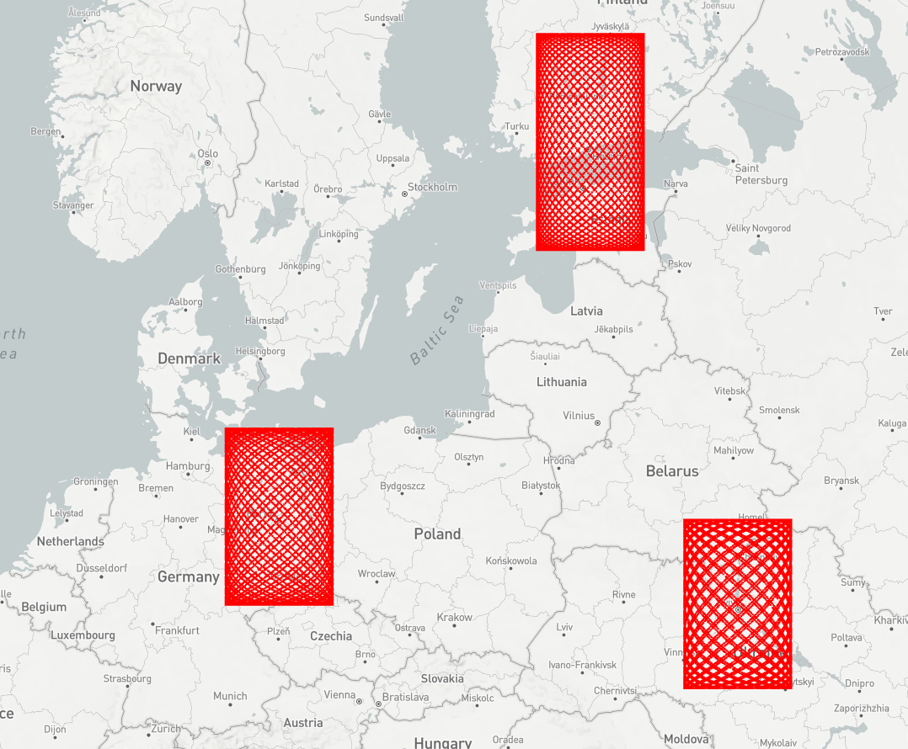

# [WIP] Fast Layers

This project is a work in progress. More documentation and layer types will be added before it is published to npm.

Custom layers that can be added to a Mapbox map. Mapbox maps have many built-in layers that are great at showing static geometry and animating how they are styled. Custom layers provide an interface for users to add their own layers that can be great at other things, like showing dynamic geometry. Fast Layers implements custom layers that make it possible to render tens or hundreds of thousands of moving entities using Mapbox gl-js.



## Getting started

Import one of the layer types and add it to your map.
```javascript
import { PointLayer } from "@sansumbrella/mapbox-fast-layers"
const layer = new PointLayer("fast-points", pointCoordinates);
map.on("load", function() {
    map.addLayer(layer);
});
```

Update the geometry for your layer as often as you like.
```javascript
layer.setCoordinates(pointCoordinates);
```

## What does it do?

- Provide an updatable drawing interface that renders within a Mapbox map.
- Update quickly, allowing you to animate what is shown on screen.

## What doesn't it do?

- manage your geometry or animation for you.
- render 3D models.
